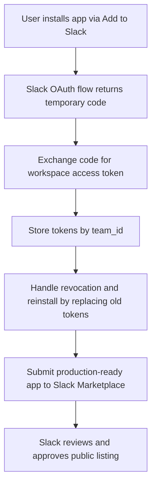

> **Not every Slack integration needs to be a full app.** Sometimes you just need to post an alert. Sometimes you're shipping a product that thousands of workspaces will install. This guide covers the spectrum — from a one-line webhook to a public Marketplace listing.

---

## Pick the Right Shape

---

## Pattern 1 — Incoming Webhooks

The simplest integration on the platform. You get a URL; you POST JSON; a message appears.

### Set it up

1. In your Slack App settings, enable **Incoming Webhooks**.
2. Click **Add New Webhook to Workspace** and pick the destination channel.
3. Copy the URL — it looks like `https://hooks.slack.com/services/T0/B0/abc...`.

### Use it
```bash
curl -X POST -H 'Content-Type: application/json' \
  --data '{"text":"Deploy succeeded :tada:"}' \
  https://hooks.slack.com/services/T0/B0/abc...
```

```typescript
await fetch(process.env.SLACK_WEBHOOK_URL!, {
  method:  'POST',
  headers: { 'Content-Type': 'application/json' },
  body:    JSON.stringify({ text: 'Deploy succeeded :tada:' }),
});
```

```python
import os, requests

requests.post(
    os.environ['SLACK_WEBHOOK_URL'],
    json={'text': 'Deploy succeeded :tada:'},
)
```

```java
import java.net.URI;
import java.net.http.HttpClient;
import java.net.http.HttpRequest;
import java.net.http.HttpResponse;

HttpClient.newHttpClient().send(
    HttpRequest.newBuilder()
        .uri(URI.create(System.getenv("SLACK_WEBHOOK_URL")))
        .header("Content-Type", "application/json")
        .POST(HttpRequest.BodyPublishers.ofString(
            "{\"text\":\"Deploy succeeded :tada:\"}"))
        .build(),
    HttpResponse.BodyHandlers.ofString());
```

```csharp
using System.Net.Http;
using System.Net.Http.Json;

var http = new HttpClient();
await http.PostAsJsonAsync(
    Environment.GetEnvironmentVariable("SLACK_WEBHOOK_URL"),
    new { text = "Deploy succeeded :tada:" });
```

```php
$ch = curl_init(getenv('SLACK_WEBHOOK_URL'));
curl_setopt_array($ch, [
    CURLOPT_POST           => true,
    CURLOPT_HTTPHEADER     => ['Content-Type: application/json'],
    CURLOPT_POSTFIELDS     => json_encode(['text' => 'Deploy succeeded :tada:']),
    CURLOPT_RETURNTRANSFER => true,
]);
curl_exec($ch);
curl_close($ch);
```

```ruby
require 'net/http'
require 'json'
require 'uri'

Net::HTTP.post(
  URI(ENV['SLACK_WEBHOOK_URL']),
  { text: 'Deploy succeeded :tada:' }.to_json,
  'Content-Type' => 'application/json',
)
```

Or with Block Kit for a richer layout:
```bash
curl -X POST -H 'Content-Type: application/json' \
  --data '{
    "blocks": [
      {"type": "header",  "text": {"type": "plain_text", "text": ":rocket: Production Deploy"}},
      {"type": "section", "text": {"type": "mrkdwn",     "text": "*Version:* `v2.14.3`\n*Author:* @alex\n*Duration:* 42s"}},
      {"type": "actions", "elements": [
        {"type": "button", "text": {"type": "plain_text", "text": "View build"}, "url": "https://ci.example.com/builds/4821"}
      ]}
    ]
  }' \
  https://hooks.slack.com/services/T0/B0/abc...
```

```typescript
await fetch(process.env.SLACK_WEBHOOK_URL!, {
  method:  'POST',
  headers: { 'Content-Type': 'application/json' },
  body: JSON.stringify({
    blocks: [
      { type: 'header',  text: { type: 'plain_text', text: ':rocket: Production Deploy' } },
      { type: 'section', text: { type: 'mrkdwn',     text: '*Version:* `v2.14.3`\n*Author:* @alex\n*Duration:* 42s' } },
      { type: 'actions', elements: [
        { type: 'button', text: { type: 'plain_text', text: 'View build' }, url: 'https://ci.example.com/builds/4821' },
      ]},
    ],
  }),
});
```

```python
import os, requests

requests.post(
    os.environ['SLACK_WEBHOOK_URL'],
    json={
        'blocks': [
            {'type': 'header',  'text': {'type': 'plain_text', 'text': ':rocket: Production Deploy'}},
            {'type': 'section', 'text': {'type': 'mrkdwn',     'text': '*Version:* `v2.14.3`\n*Author:* @alex\n*Duration:* 42s'}},
            {'type': 'actions', 'elements': [
                {'type': 'button', 'text': {'type': 'plain_text', 'text': 'View build'}, 'url': 'https://ci.example.com/builds/4821'},
            ]},
        ],
    },
)
```

```java
import java.net.URI;
import java.net.http.HttpClient;
import java.net.http.HttpRequest;
import java.net.http.HttpResponse;

String payload = """
    {
      "blocks": [
        {"type": "header",  "text": {"type": "plain_text", "text": ":rocket: Production Deploy"}},
        {"type": "section", "text": {"type": "mrkdwn",     "text": "*Version:* `v2.14.3`\\n*Author:* @alex\\n*Duration:* 42s"}},
        {"type": "actions", "elements": [
          {"type": "button", "text": {"type": "plain_text", "text": "View build"}, "url": "https://ci.example.com/builds/4821"}
        ]}
      ]
    }
    """;

HttpClient.newHttpClient().send(
    HttpRequest.newBuilder()
        .uri(URI.create(System.getenv("SLACK_WEBHOOK_URL")))
        .header("Content-Type", "application/json")
        .POST(HttpRequest.BodyPublishers.ofString(payload))
        .build(),
    HttpResponse.BodyHandlers.ofString());
```

```csharp
using System.Net.Http;
using System.Net.Http.Json;

var http = new HttpClient();
await http.PostAsJsonAsync(
    Environment.GetEnvironmentVariable("SLACK_WEBHOOK_URL"),
    new {
        blocks = new object[] {
            new { type = "header",  text = new { type = "plain_text", text = ":rocket: Production Deploy" } },
            new { type = "section", text = new { type = "mrkdwn",     text = "*Version:* `v2.14.3`\n*Author:* @alex\n*Duration:* 42s" } },
            new { type = "actions", elements = new object[] {
                new { type = "button", text = new { type = "plain_text", text = "View build" }, url = "https://ci.example.com/builds/4821" },
            }},
        }
    });
```

```php
$payload = json_encode([
    'blocks' => [
        ['type' => 'header',  'text' => ['type' => 'plain_text', 'text' => ':rocket: Production Deploy']],
        ['type' => 'section', 'text' => ['type' => 'mrkdwn',     'text' => "*Version:* `v2.14.3`\n*Author:* @alex\n*Duration:* 42s"]],
        ['type' => 'actions', 'elements' => [
            ['type' => 'button', 'text' => ['type' => 'plain_text', 'text' => 'View build'], 'url' => 'https://ci.example.com/builds/4821'],
        ]],
    ],
]);

$ch = curl_init(getenv('SLACK_WEBHOOK_URL'));
curl_setopt_array($ch, [
    CURLOPT_POST           => true,
    CURLOPT_HTTPHEADER     => ['Content-Type: application/json'],
    CURLOPT_POSTFIELDS     => $payload,
    CURLOPT_RETURNTRANSFER => true,
]);
curl_exec($ch);
curl_close($ch);
```

```ruby
require 'net/http'
require 'json'
require 'uri'

payload = {
  blocks: [
    { type: 'header',  text: { type: 'plain_text', text: ':rocket: Production Deploy' } },
    { type: 'section', text: { type: 'mrkdwn',     text: "*Version:* `v2.14.3`\n*Author:* @alex\n*Duration:* 42s" } },
    { type: 'actions', elements: [
      { type: 'button', text: { type: 'plain_text', text: 'View build' }, url: 'https://ci.example.com/builds/4821' },
    ]},
  ],
}

Net::HTTP.post(URI(ENV['SLACK_WEBHOOK_URL']), payload.to_json, 'Content-Type' => 'application/json')
```

<Callout type="info">
**A webhook URL is tied to a single channel.** If you need to post to many channels, use a bot token and `chat.postMessage` — that's just as fast and doesn't lock you into one destination.
</Callout>

### When webhooks are the wrong choice

- You need to **read** anything from Slack (messages, channel lists, user profiles).
- You need to **react** to user actions (button clicks, slash commands, events).
- You need to post to **multiple channels** or workspaces from one configuration.

In any of those cases, build a [bot](page:guides/bots) instead.

---

## Pattern 2 — Distributing Your App


### The OAuth exchange in code
```bash
# After Slack redirects the user back to your callback with ?code=...,
# exchange the code for an access token:

curl -X POST "https://slack.com/api/oauth.v2.access" \
  -H "Content-Type: application/x-www-form-urlencoded" \
  --data-urlencode "client_id=$SLACK_CLIENT_ID" \
  --data-urlencode "client_secret=$SLACK_CLIENT_SECRET" \
  --data-urlencode "code=$AUTHORIZATION_CODE" \
  --data-urlencode "redirect_uri=$SLACK_REDIRECT_URI"
```

```typescript
import { Client } from 'slack-apimatic-sdk';

app.get('/slack/oauth/callback', async (req, res) => {
  const code = req.query.code as string;

  const slack = new Client({ /* no token yet */ });
  const result = await slack.oauthController.v2Access({
    client_id:     process.env.SLACK_CLIENT_ID!,
    client_secret: process.env.SLACK_CLIENT_SECRET!,
    code,
    redirect_uri:  process.env.SLACK_REDIRECT_URI!,
  });

  await storeInstallation({
    team_id:    result.team!.id,
    team_name:  result.team!.name,
    bot_token:  result.access_token,
    bot_user_id: result.bot_user_id,
  });

  res.redirect('/dashboard?installed=1');
});
```

```python
import os
from flask import Flask, request, redirect
from slackapimaticsdk.client import Client

app = Flask(__name__)

@app.get('/slack/oauth/callback')
def oauth_callback():
    slack  = Client()  # no token yet
    result = slack.oauth.v2_access(
        client_id     = os.environ['SLACK_CLIENT_ID'],
        client_secret = os.environ['SLACK_CLIENT_SECRET'],
        code          = request.args['code'],
        redirect_uri  = os.environ['SLACK_REDIRECT_URI'],
    ).body

    store_installation(
        team_id     = result['team']['id'],
        team_name   = result['team']['name'],
        bot_token   = result['access_token'],
        bot_user_id = result['bot_user_id'],
    )

    return redirect('/dashboard?installed=1')
```

```java
import io.sdks.slack.SlackClient;
import org.springframework.web.bind.annotation.*;
import org.springframework.web.servlet.view.RedirectView;

@RestController
public class OAuthController {

  @GetMapping("/slack/oauth/callback")
  public RedirectView callback(@RequestParam String code) throws Exception {
    SlackClient slack = new SlackClient.Builder().build(); // no token yet
    var result = slack.getOauthController().v2Access(
        System.getenv("SLACK_CLIENT_ID"),
        System.getenv("SLACK_CLIENT_SECRET"),
        code,
        System.getenv("SLACK_REDIRECT_URI")
    ).getResult();

    storeInstallation(
        result.getTeam().getId(),
        result.getTeam().getName(),
        result.getAccessToken(),
        result.getBotUserId()
    );

    return new RedirectView("/dashboard?installed=1");
  }
}
```

```csharp
using SlackApimaticSdk;

app.MapGet("/slack/oauth/callback", async (string code) =>
{
    var slack = new SlackClient.Builder().Build(); // no token yet
    var result = (await slack.OauthController.V2AccessAsync(
        clientId:     Environment.GetEnvironmentVariable("SLACK_CLIENT_ID"),
        clientSecret: Environment.GetEnvironmentVariable("SLACK_CLIENT_SECRET"),
        code:         code,
        redirectUri:  Environment.GetEnvironmentVariable("SLACK_REDIRECT_URI"))).Data;

    await StoreInstallationAsync(
        teamId:    result.Team.Id,
        teamName:  result.Team.Name,
        botToken:  result.AccessToken,
        botUserId: result.BotUserId);

    return Results.Redirect("/dashboard?installed=1");
});
```

```php
use SlackApimaticSdk\SlackClientBuilder;
use Psr\Http\Message\ServerRequestInterface as Request;
use Psr\Http\Message\ResponseInterface     as Response;

$app->get('/slack/oauth/callback', function (Request $req, Response $res) {
    $slack  = SlackClientBuilder::init()->build(); // no token yet
    $result = $slack->getOauthController()->v2Access([
        'client_id'     => getenv('SLACK_CLIENT_ID'),
        'client_secret' => getenv('SLACK_CLIENT_SECRET'),
        'code'          => $req->getQueryParams()['code'],
        'redirect_uri'  => getenv('SLACK_REDIRECT_URI'),
    ])->getResult();

    storeInstallation([
        'team_id'     => $result->team->id,
        'team_name'   => $result->team->name,
        'bot_token'   => $result->access_token,
        'bot_user_id' => $result->bot_user_id,
    ]);

    return $res->withHeader('Location', '/dashboard?installed=1')->withStatus(302);
});
```

```ruby
require 'sinatra'
require 'slack_apimatic_sdk'

get '/slack/oauth/callback' do
  slack  = SlackApimaticSdk::Client.new # no token yet
  result = slack.oauth.v2_access(
    client_id:     ENV['SLACK_CLIENT_ID'],
    client_secret: ENV['SLACK_CLIENT_SECRET'],
    code:          params['code'],
    redirect_uri:  ENV['SLACK_REDIRECT_URI'],
  ).data

  store_installation(
    team_id:     result['team']['id'],
    team_name:   result['team']['name'],
    bot_token:   result['access_token'],
    bot_user_id: result['bot_user_id'],
  )

  redirect '/dashboard?installed=1'
end
```

<Callout type="warning">
**Multi-tenant token storage is the #1 source of bugs in distributed Slack apps.** Always look up the token by `team_id` before every API call. Never cache a single global token.
</Callout>

---

## Pattern 3 — Cross-System Sync

Many integrations are about syncing data between Slack and another system: pulling Slack messages into a CRM, mirroring tickets into a triage channel, archiving conversations for compliance.

The building blocks:

---

## Real-World Examples

---

## Production Checklist

- **Use the SDK, not raw HTTP.** Retries, signature verification, pagination, and rate limit handling are already built in.
- **Verify every inbound request.** Compute the HMAC of the raw body with your **Signing Secret** and reject mismatches.
- **Store tokens encrypted at rest.** Treat bot and user tokens like passwords — they grant full app access to a workspace.
- **Page through everything.** `conversations.history`, `users.list`, and friends return cursors, not full lists. Don't assume one page is enough.
- **Handle `account_inactive` and `token_revoked`.** Workspaces churn, users leave, admins uninstall. Your code should mark dead tokens and stop using them.

---

## Next Steps
